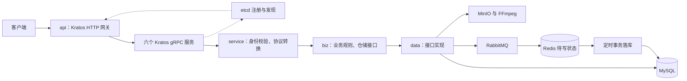

# 极简版抖音 · Kratos

短视频后端：注册登录、Feed 与发布、点赞、评论、关注和私信。当前实现采用 Kratos v2.9.2，包含一个 HTTP 网关和六个 gRPC 服务。项目源自字节跳动青训营「降本增效」队。

## 先建立这张地图



service/biz/data 是每个服务进程内部的层次，并非三个额外服务。六个业务服务共用数据库，进程按业务拆分，数据库边界仍然共享。

| 位置 | 职责 | 首次阅读重点 |
| --- | --- | --- |
| `cmd/{api,user,video,comment,favorite,relation,message}` | 七个程序入口 | 入口只选择服务名 |
| `internal/app` | 创建资源与服务器、管理生命周期 | `run.go` → `app.go` |
| `api/*/v1` | Protobuf 请求、响应、gRPC 契约 | 先读 .proto，无需逐行阅读生成代码 |
| `internal/server` | 路由、传输、编解码、限流 | http.go 是客户端入口地图 |
| `internal/service` | 校验 token、调用 usecase、组装响应 | 从某个 RPC 方法跟进 |
| `internal/biz` | 业务规则、仓储接口 | 不依赖 GORM 和 Protobuf |
| `internal/data` | MySQL、Redis、MQ、媒体与加密实现 | 仓储接口的实际实现 |
| `internal/conf`、`config/kratos.yml` | 配置模型与本地配置 | 无包导入初始化副作用 |
| `pkg/jwt` | token 签发与验证 | 六个服务统一使用 |
| `scripts`、`dockerfiles` | 构建、启动、协议生成、真实组件验收 | 从本地运行步骤开始 |

## 业务边界

| 服务 | 功能 | 默认端口 |
| --- | --- | --- |
| api | /douyin HTTP 接口及 /healthz | 8089 |
| user | 注册、登录、用户信息 | 8085 |
| video | Feed、发布、作品列表 | 8086 |
| comment | 评论创建、删除、列表 | 8081 |
| favorite | 点赞、取消赞、喜欢列表 | 8082 |
| relation | 关注、取关、关注/粉丝/朋友列表 | 8084 |
| message | 私信、按客户端时间游标读取聊天 | 8083 |

原有 16 个接口继续使用 /douyin 路径。除视频发布为 multipart 外，请求字段通过 query 传入；成功 JSON 保留数字 ID、布尔零值和空数组。错误通过 HTTP 状态码和 status_code=-1 返回。favorite 在原有协议中表示点赞。

## 阅读顺序

1. 注册登录：internal/server/http.go → api/user/v1/user.proto → internal/service/user.go → internal/biz/user.go → internal/data/user.go。用这一条链认识各层。
2. Feed：关注匿名访问、浏览者身份、作者信息、媒体 URL 和 next_time。is_follow、is_favorite 属于浏览者视角。
3. 评论删除：评论作者或视频作者任一可删，跟进业务校验和事务中的再次校验。
4. 点赞：HTTP 成功表示 RabbitMQ 已确认接收；Redis 合并待写状态，定时任务事务落库。理解最终一致性和重复消息。
5. 视频与私信：前者涉及请求结束后的任务及失败补偿；后者涉及互相关注、加密和增量查询。

每条链记录：输入、规则、数据变化、失败表现。无需先把所有工具包逐行看完。

## 本地运行（Windows）

需要 Go、PowerShell 7、Docker Desktop Linux engine，以及视频服务可执行的 FFmpeg。

```powershell
docker compose up -d --wait
go run ./cmd/keygen -dir "config/keys"
go run ./cmd/user -config "config/kratos.yml" -migrate
go run ./cmd/video -config "config/kratos.yml" -prepare-media
pwsh -File "scripts/build.ps1"
pwsh -File "scripts/start.ps1"
Invoke-RestMethod "http://127.0.0.1:8089/healthz"
```

- prepare-media 显式创建四个桶、十张默认头像和一张背景图，已有图片不覆盖。这是环境初始化，应用运行时不会临时生成缺失资源。
- MinIO 首次启动从指定版本源码构建镜像。日志和进程记录在 .runtime。
- 停止应用：`pwsh -File "scripts/stop.ps1"`。Windows 使用终止进程，可能中断上传；Linux shutdown.sh 使用 SIGTERM。
- 停止基础设施：`docker compose stop`，保留数据卷。
- 已有环境须先备份数据库、对象和密钥。保留原 RSA 密钥并配置路径，换密钥后旧私信不能解密。
- migrate 添加视频状态、动作序号表、关系唯一索引并扩展消息字段。历史重复关系需先审查处理，不能在生产启动时自动建表。

其他环境另存配置，通过 -config 指定；支持 ${ENV_NAME} 展开。副本仅使用 database.replicas 明确配置的地址。HTTP 支持配置证书和私钥。容器运行应用需另配容器内可达的依赖和服务注册地址，并挂载消息密钥。

## 验证与协议生成

```powershell
go build ./...
go vet ./...
go test -race ./...
pwsh -File "scripts/integration.ps1"
```

集成脚本使用独立 db_kratos_integration 数据库，运行七个应用与 MySQL、Redis、RabbitMQ、etcd、MinIO、FFmpeg，覆盖业务链、动作幂等和失败后保留待写状态。测试留下带唯一名称的数据和媒体桶，不操作生产数据库。

改 .proto 后运行 `pwsh -File "scripts/generate.ps1"`，需 protoc，两个固定版本 Go 插件安装在项目 .tools。Linux 使用 scripts/generate.sh。不要手改生成文件。

迁移依据及结果见 [迁移记录](docs/KRATOS_MIGRATION.md)。旧 docs/UA_ONBOARDING.md 与 .ua 是迁移前阅读产物，不作为当前架构依据。

## 当前限制

- 密码摘要仍使用已有 MD5 格式，本次没有完成密码安全升级。
- 视频上传是进程内任务，崩溃可能留下 uploading 记录；发布成功响应不等于处理完成。
- 点赞/关注最终一致，读取可能暂时看不到动作；Redis 序号需与数据库一致地持久化和恢复。
- Feed/私信沿用时间游标，同一毫秒多条记录的边界仍有局限。
- 私信沿用 RSA PKCS#1 v1.5；2048 位密钥单条明文最多 245 字节。
- 内部 gRPC 使用明文连接，需要受控网络；healthz 只表示网关进程响应。

这些限制来自当前代码。本地验收不能证明生产吞吐、可用性或旧数据升级成功。
