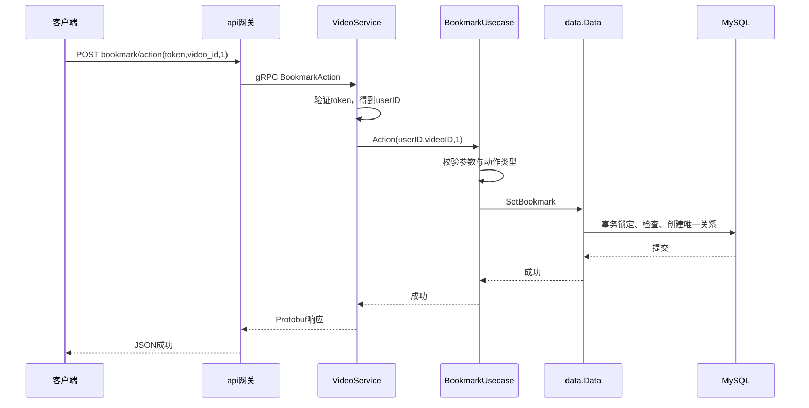

# 从需求到交付：私人视频收藏

这是在 Kratos 重构提交 `17e7447` 之后开展的一次后端业务练习。业务背景由本次练习设定，并非项目已有用户调研结果。新增能力使用 bookmark，原 favorite 继续表示点赞。

## 1. 先说用户问题

设想用户刷到一个教程，暂时没有时间看，希望晚上能快速找回来。已有点赞会改变视频点赞数与作者获赞数，用户需要一个独立的私人回看列表。

目标：登录用户可保存可播放的视频，立即在自己的收藏列表看到，并能移除。是否提高回看率要上线后测量，当前没有真实业务数据。

把“加一个收藏按钮”变成可以开发的需求，需要明确：谁操作、收藏什么、重复点击怎么办、谁能看、列表如何排序、失败如何提示。

## 2. PRD：规则先定下来

| 编号 | 规则 | 验收例子 |
| --- | --- | --- |
| R1 | 必须登录，操作人与列表主人由 token 决定 | 无 token 返回 401；传别人 user_id 不会切换列表主人 |
| R2 | 仅收藏存在且 ready 的视频，包括自己的视频 | 不存在或 uploading 视频返回 404 |
| R3 | action_type=1 收藏，2 取消，其余非法 | action_type=3 返回 400 |
| R4 | 重复收藏与重复取消均成功，不产生重复关系 | 连续收藏两次只有一条；不存在的关系取消也成功 |
| R5 | 收藏不修改点赞、获赞、作品数 | 收藏前后原计数不变 |
| R6 | 按收藏记录 ID 倒序；重复收藏不改顺序；取消后再收藏回到最前 | 先 A 后 B 为 B,A；再收藏 A 仍为 B,A |
| R7 | 只展示尚存在且 ready 的视频 | 失效视频从列表过滤；仍允许取消其收藏 |
| R8 | cursor=0 首屏，limit=0 默认20；上限50 | 负游标、负 limit 或 limit>50 返回400 |
| R9 | 成功响应意味着数据库提交；下一次主库读取可见 | 收藏后立刻 GET 列表可看到 |

范围是后端两个接口及完整分页。文件夹、共享收藏、批量操作和客户端页面不属于此次需求。客户端约定：收到成功后更新按钮；失败保留原状态并显示错误；加载下一页传 next_cursor；has_more=false 停止继续加载。

状态只有两种：未收藏 → 收藏 → 未收藏。重复同类动作不改变状态；同时收藏/取消按数据库实际串行执行顺序决定最终状态，不保证网络请求的发起顺序。

隐私规则最容易漏掉：公开用户主页的 user_id 参数不能沿用到私人列表。接口没有 user_id 字段，身份只取签名 token。

## 3. 技术方案与取舍

复用 video 服务和现有 Video 响应，增加 BookmarkUsecase、BookmarkRepository 及 user_bookmarks 表。无需新增进程或队列。

当前点赞通过 MQ/Redis 异步落库；收藏选择直接写 MySQL，因为这次规则要求立即可读，操作只涉及一张关系表。是否需要缓存需有负载证据，不能仅因为项目已有 Redis 就加入缓存。

新表字段：id、user_id、video_id、created_at。唯一约束(user_id, video_id)保证重复请求只有一条；索引(user_id,id)支持用户过滤、倒序和游标。创建采用 GORM 的 OnConflict DoNothing，取消硬删除关系，不影响视频记录。

外部能力依据：[GORM 官方 Upsert 文档](https://gorm.io/docs/create.html#Upsert-On-Conflict)、[嵌入模型文档](https://gorm.io/docs/models.html#Embedded-Struct)、[主库读取文档](https://gorm.io/docs/dbresolver.html#Manual-connection-switching)。用已有 ORM 能力表达唯一关系与读源，避免另写去重或副本兜底机制。

操作事务先锁用户；收藏时再锁视频并检查 ready，在同一事务中确认可播放状态并写入。事务提交后返回。收藏列表及其作者、点赞和关注信息全部从主库读，避免配置副本时收藏成功但响应仍读取不到作者。app 注入共享连接池的主库读取视图，复用既有视频装饰实现。普通数据访问失败直接返回错误，不编写“失败也成功”的兜底。

分页使用收藏关系 ID，而非视频发布时间。一次查 limit+1 条判断 has_more，返回前 limit 条；next_cursor 是本页最后一条收藏 ID。下一页查 id<cursor。新收藏出现在前方，不插入后续页；这不是数据库快照，取消和视频失效可以使后续页数量减少。

技术评审的关键问题及本次决定：

- 是否复用点赞表？独立建表，保持业务语义和计数独立。
- 重试导致重复吗？数据库唯一约束保证；重复动作不改原 ID。
- 如何阻止越权？token 决定用户，仓储查询始终绑定该 ID。
- 视频不可播放怎样处理？创建拒绝，列表过滤，取消允许。
- 分页会漏掉同毫秒记录吗？用关系 ID 游标，避免时间相同的问题。
- 性能能否满足生产？当前没有流量和 SLA 数据，只能说明每页最多51条，需上线前结合实际容量测量。

## 4. 接口契约

沿用项目 query 参数风格：

| HTTP | 参数 | 结果 |
| --- | --- | --- |
| POST /douyin/bookmark/action/ | token、video_id、action_type | status_code、status_msg |
| GET /douyin/bookmark/list/ | token、cursor、limit | status_code、status_msg、video_list、next_cursor、has_more |

视频 ID、next_cursor 为 JSON 数字，has_more 为布尔，空列表为 []。新方法加入 api/video/v1/video.proto 的 VideoService。错误统一沿用 Kratos 和网关编码。

## 5. 把方案拆成可以验收的任务

| 顺序 | 任务 | 完成证据 |
| --- | --- | --- |
| 1 | 固定规则与接口契约 | 本文 R1–R9、proto |
| 2 | 建表和仓储实现 | 显式 migrate；唯一约束及索引 |
| 3 | biz 校验与分页 | 规则与失败路径单元验证 |
| 4 | service 身份、协议转换及网关路由 | 实际 HTTP/gRPC 测试 |
| 5 | 依赖组装与真实组件验收 | 收藏后立即读取、隐私、幂等、分页、原计数 |
| 6 | 评审、交付与发布准备 | 检查记录、运行证据、发布/回滚步骤 |

这比“开发收藏功能”更可执行：每项都有输入、改动位置和完成证据。估时应在熟悉相关文件和环境后进行，本次不把示例估时当作真实团队排期。

## 6. 跟着一条请求理解 Kratos

阅读重点：service 知道 token 和 proto；biz 知道收藏规则，依赖仓储接口；data 知道 GORM、表和事务；app 将它们组装起来。interface 表示业务需要的能力，依赖注入使实际数据库实现传入 usecase。

## 7. 测试、评审与验收

单元测试负责非法动作、分页边界和仓储错误传播。HTTP/gRPC 测试负责身份、路由、query 和返回格式。真实 MySQL 测试负责视频状态、唯一约束、并发重复、读主库和排序；完整应用验收检查两个用户隔离、收藏立即可见及原点赞数不变。

代码评审时沿 R1–R9 核对，重点检查私人列表是否信任客户端 user_id、事务是否在失败时回滚、唯一约束是否真实存在、next_cursor 是否来自收藏 ID。作者自查不等于另一个工程师的独立批准；仓库 CI 配置也不等于远端 CI 已运行。

2026-10-01 本地执行记录：

| 检查 | 结果 | 能证明什么 |
| --- | --- | --- |
| 业务分页/非法参数/读写错误测试 | 通过 | 业务控制流及失败传播 |
| 实际 HTTP → gRPC → VideoService → biz（仓储替身） | 通过 | token 身份、伪造 user_id 无法切换主人、两个身份隔离、JSON 类型及错误处理；不证明 MySQL 行为 |
| go build ./...、go test -race ./... | 通过 | 七个应用源码能构建，当前常规测试与竞态检查通过 |
| go vet | 通过 | 当前静态检查通过 |
| TestBookmarkDatabaseRules（真实 MySQL） | 通过 | 20 个并发重复请求只有一条，取消/重收藏、排序、游标、私人隔离、ready 过滤及原计数不变 |
| SHOW INDEX user_bookmarks | 通过 | 实际存在唯一(user_id,video_id)和分页(user_id,id)索引 |
| TestBookmarkReadAfterWriteWithLaggingReplica | 通过 | 空 schema 模拟未追平读源；默认读取无作者数据，收藏完整装饰响应仍立即可见；不证明真实主从复制 |
| TestCompleteBusinessFlow（完整七应用） | 通过 | 收藏自己或他人视频、重复动作、立即读取/取消、两个身份隔离、匿名拒绝、原业务回归及默认媒体可读 |
| TestConcurrentActionIdempotency、TestRedisPendingSurvivesFailureAndNewAction | 通过 | 原有点赞并发计数、旧动作、数据库失败回滚及 Redis 新状态保留 |
| 通用应用镜像构建与 -h 执行 | 通过 | SERVICE=api 的 Linux 镜像可构建且程序可执行；不代表生产部署 |

源码完整连接了协议、路由、service、biz、data 和 app，没有占位接口、TODO 或失败后假成功的兜底。上述证据来自本地后端验收，不等于产品负责人签字或线上发布。运行 `pwsh -File "scripts/integration.ps1"` 可重跑五项真实组件测试。该环境隔离 SQL、Redis 和 MQ，注册发现服务名及媒体桶也采用每轮唯一名称。

提测时直接交付这些信息：需求与技术方案为本文；新增两个 bookmark 接口及 user_bookmarks 表；无新增进程和业务配置项；在测试环境显式执行 migrate；测试账号由集成脚本每次注册；影响范围为 video/api 及显式迁移；验证结果为上表。远端 MR/PR、独立人工评审与 CI 未执行，不能用本地作者自查替代。

产品验收按业务规则回看证据，而不是只看测试命令返回成功：R1 对应匿名和两用户隔离；R2/R7 对应可播放状态、自己视频及失效过滤；R3/R8 对应非法动作和分页参数；R4/R6 对应并发幂等与实际排序；R5 对应原计数；R9 对应提交后即时列表以及未追平读源。此次练习完成了这些后端场景，客户端按钮和页面尚无实现，无法从文件直接确认真实交互验收。

实现对应文件：

- api/video/v1/video.proto：四个消息和两个 RPC。
- internal/server/http.go：两个 HTTP 路由。
- internal/service/video.go：身份只取 token，组装分页响应。
- internal/biz/bookmark.go：动作、分页规则与已有视频信息装饰。
- internal/data/bookmark.go：表、事务、唯一约束与主库游标查询。
- internal/data/data.go：显式 migrate 新表、共享连接池的主库读取视图。
- internal/app/app.go：把主库仓储及复用的视频装饰实现注入 BookmarkUsecase。
- internal/biz/bookmark_test.go、internal/server/bookmark_test.go、internal/data/bookmark_integration_test.go、internal/integration/flow_test.go：分层验证。

## 8. 发布与回滚：计划和实际执行分开

建议顺序：备份 → 在测试环境执行新建表迁移 → 部署 video → 部署 api → 客户端联调 → 产品按 R1–R9 验收 → 小范围开放 → 观察 → 扩大范围。先部署服务端再开放客户端，避免网关请求不存在的 RPC。

回滚应用到重构提交 17e7447 时，新表可保留；原代码不读取该表。不要回滚时删除用户收藏数据。正在执行的请求需先结束，关闭新入口后再回滚服务端。

灰度建议先向内部测试账号开放收藏入口，再扩大用户范围；每批检查收藏动作/列表错误和延迟、现有接口是否异常。出现已收藏立即读取失败或私人数据越权时停止放量并关闭入口，再按上述顺序回滚。具体阈值需根据实际 SLA 和基线确定，当前没有依据填写数值。

实际仓库没有灰度发布系统或线上部署参数，无法从文件直接确认生产发布操作，也没有执行生产发布。本文完成本地后端验收和发布方案演练，生产发布、压测、客户端验收仍是团队交付阶段的工作。

## 9. 上线后怎样判断价值

拟观察：收藏请求成功率、收藏列表错误率和延迟、收藏后回看比例。后者定义为一段时间内收藏用户中播放过已收藏视频的用户比例，需要客户端播放事件和关联数据。

当前日志可观察服务操作、错误码和耗时，已隐藏请求参数；没有播放埋点或数据分析平台，不能虚构回看率、线上成功率或收益。需求复盘应依据新增监测结果决定继续优化，而不是只统计写了多少代码。

## 10. 本次开发复盘

- 即时可见需要检查整条响应链。原方案只让收藏关系读主库，作者装饰仍读副本；真实 MySQL 双读源测试先复现 404，再验证修复。这是从 R9 推导验证场景的例子。
- 隔离测试需要覆盖所有状态组件。只换 SQL 库不能隔离 Redis 待写状态和 MQ 消费；清理顺序错误又会使一次通过、下一次失败。此次补齐命名空间隔离和清理错误报告，并检查运行后无遗留 CAS/待写键。
- 代码检查、真实组件验收、产品验收和生产效果各自提供不同证据。此次能证明后端实现符合已定规则；能否提高回看率，仍须依据上线后的真实事件数据判断。

学习时按第1→2→3→5→6→7→8→9节跟读：每一步明确本阶段需要回答的问题、产物及下一阶段的进入条件。先从 R1、R4、R9 三条规则追到代码和测试，再扩展到分页与失效视频，能把业务规则与框架职责对应起来。
